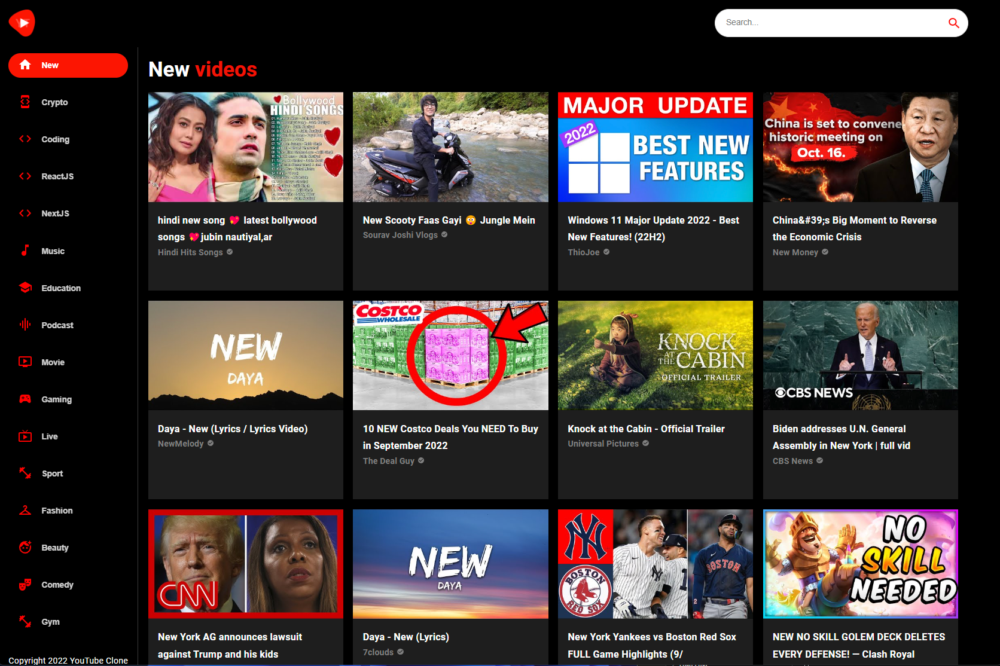

# YouTube Clone▶️

## General Info
**Modern fully functional and responsive YouTube Clone application.** 
<a href="https://youtube-clone-37.netlify.app/" target="_blank" >👉🎯👈</a>

***

Technologies:
- React JS
- Material UI 5

## Available Scripts

In the project directory, you can run:

### `npm start`

Runs the app in the development mode.\
Open [http://localhost:3000](http://localhost:3000) to view it in your browser.
